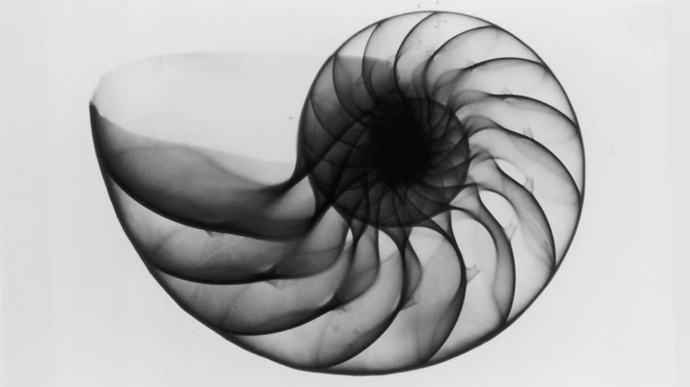
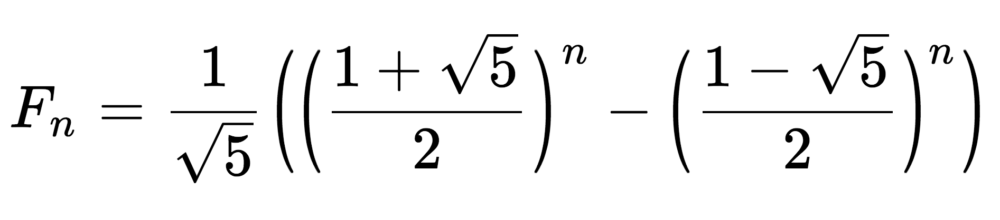

**Aya Eyad Aly**,
Section 1, BN 11
# **Fibonacci Sequence**

---


## What is the Fibonacci sequence?

**The Fibonacci Sequence** is the series of numbers: 0, 1, 1, 2, 3, 5, 8, 13, 21, 34, etc.
The next number is the sum of the 2 numbers preceding it.

Many natural phenomena follow the Fibonacci sequence. As branching in trees, the fruit sprouts of a pineapple and the flowering of an artichoke.

**The golden ratio** of 1.618, a universal law that represents the **“ideal”** in all forms of life and matter ,dear to mathematicians, scientists, and naturalists across history is derived from the Fibonacci sequence where the quotient between each successive pair of numbers approximates to 1.618.

---
## Finding the n<sup>th</sup> number in the Fibonacci sequence:
<font size = "2">*Please note that calculations are done assuming the series is zero-indexed.*</font>

## Method 1
Using **Recursion**

```cpp
int fib(int n){
if(n==0)
return 0;
else if(n==1)
return 1;
else
return fib(n-1)+ fib(n-2);
```

<font size="3"> **This method has** </font>
* A time complexity of **O(2<sup>n</sup>)**
* A memory complexity of **O(n)** 

---
## Method 2

Forming an **array** of Fibonacci numbers until the desired n.

```cpp
int fib(int n) {
    if(n==0)
        return 0;
    else if(n==1)
        return 1;
    else {
        int arr[n + 1];
        arr[0] = 0, arr[1] = 1;
        for (int i = 2; i <= n; i++) {
            arr[i] = arr[i - 1] + arr[i - 2];
        }
        return arr[n];
    }
}
```
<font size="3"> **This method has** </font>
* A time complexity of **O(n)**
* A memory complexity of **O(n)**

---
## Method 3

Similar to the previous method but **does not use an array** as we need only the n<sup>th</sup> element, so there is no need to keep the numbers preceding it.

```cpp
int fib(int n) {
    if(n==0)
        return 0;
    else if(n==1)
        return 1;
    else {
        int x = 0, y = 1;
        for(int i=2;i<=n;i++){
            if(i%2==0)//even
                x+=y;
            else
                y+=x;
        }
        return max(x,y);
    }
}
```
<font size="3"> **This method has** </font>
* A time complexity of **O(n)**
* A memory complexity of **O(1)**

---
## Method 4

Using the **Benet's Formula** to get the n<sup>th</sup> number directly:


````cpp
int fib(int n) {
    //to begin index from zero
    int m = n - 1;
    return (pow(1+ sqrt(5),m+1)- pow(1- sqrt(5),m+1))/(sqrt(5)* pow(2, m+1));
}
````
<font size="3"> **This method has** </font>
* A time complexity of **O(1)**
* A memory complexity of **O(1)**

---
## Method 5

As mentioned earlier, the **golden ratio** is derived from the Fibonacci sequence where the **quotient** between each successive pair of numbers **approximates** to 1.618.

This method deals with the Fibonacci sequence as a geometric sequence to find the n<sup>th</sup> term.

Since it uses an approximate value of the golden ratio it is **NOT as accurate** as the other methods mentioned.

```c++
int fib(int n) {
//approximate value of the golen ratio
double golden = 1.6180339;
// Fibonacci numbers upto n = 5 since it would not be accurate at all to calculate them with this method
int f[6] = { 0, 1, 1, 2, 3, 5 };
// Fibonacci numbers for n < 6
if (n < 6)
    return f[n];
int i = 5, fb = 5;
while (i < n) {
    fb = round(fb * golden);
    i++;
}
return fb;
}
```
<font size="3"> **This method has** </font>
* A time complexity of **O(n)**
* A memory complexity of **O(1)**

---
## Method 6
Using **Matrix exponentiation**
```c++
int fib(int n) {
    int F[2][2] = { { 1, 1 }, { 1, 0 } };
    if (n == 0)
        return 0;
    power(F, n - 1);
    return F[0][0];
}

void multiply(int F[2][2], int M[2][2]){
    
    int x = F[0][0] * M[0][0] +
            F[0][1] * M[1][0];
    int y = F[0][0] * M[0][1] +
            F[0][1] * M[1][1];
    int z = F[1][0] * M[0][0] +
            F[1][1] * M[1][0];
    int w = F[1][0] * M[0][1] +
            F[1][1] * M[1][1];

    F[0][0] = x;
    F[0][1] = y;
    F[1][0] = z;
    F[1][1] = w;
}

void power(int F[2][2], int n)
{
    int i;
    int M[2][2] = { { 1, 1 }, { 1, 0 } };

  
    for(i = 2; i <= n; i++)
        multiply(F, M);
}
```
<font size="3"> **This method has** </font>
* A time complexity of **O(n)**
* A memory complexity of **O(1)**

---
# Summary Table
| Methods | Time complexity | Space complexity
--- | --- | ---
**Method 1**| O(2<sup>n</sup>) | O(n)
**Method 2** | O(n) | O(n)
**Method 3** | O(n) | O(1)
**Method 4** | O(1) | O(1)
**Method 5** | O(n) | O(1)
**Method 6** | O(n) | O(1)

<font size = "4"> We can therefore conclude that the best method is the **3<sup>rd</sup> method** that uses **Benet's formula** </font>

---
### References

- [Program for nth Fibonacci number, Geeksforgeeks](https://www.geeksforgeeks.org/program-for-nth-fibonacci-number/)
- [BBC Radio 4 - In Our Time, The Fibonacci Sequence](https://www.google.com/url?sa=i&url=https%3A%2F%2Fwww.bbc.co.uk%2Fprogrammes%2Fb008ct2j&psig=AOvVaw2gVRBlyCaay1oSjoQuNhD3&ust=1665082042547000&source=images&cd=vfe&ved=0CA4Q3YkBahcKEwjQttSZ4Mn6AhUAAAAAHQAAAAAQAw)
- [Fibonacci sequence with Golden Ratio, Geeksforgeeks](https://www.geeksforgeeks.org/find-nth-fibonacci-number-using-golden-ratio/)
- [Fibonacci formula calculator image](https://www.inchcalculator.com/fibonacci-sequence-calculator/)
